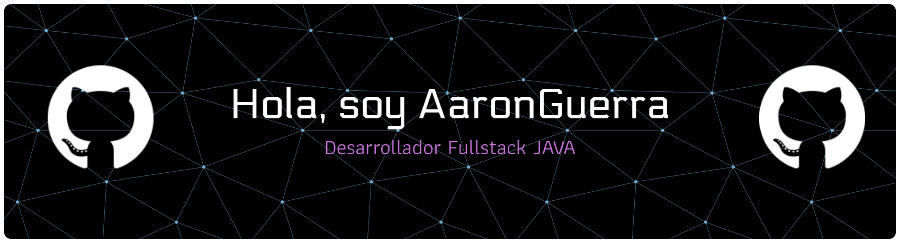

<h1 align="center"></h1>
 
<!-- Typing SVG by DenverCoder1 - https://github.com/DenverCoder1/readme-typing-svg -->
<p align="center">
  <a href="https://github.com/DenverCoder1/readme-typing-svg"></a>
</p>

<hr>


```
Soy-AaronGuerra@github
-------------------------
💻 Estoy estudiando en el Bootcamp de Generation sobre Desarrollo Full Stack JAVA.
🌐 Estoy aprendiendo desarrollo web.
📚 Tengo estudios en Diseño Gráfico Multimedia: Editorial, Gráfica y Audiovisual.
📝 Quiero crecer como desarrollador Full Stack para complementar mis conocimientos.
🌟 Lenguajes principales: JAVA, JavaScript.
🎵 Me gusta el rock, power metal, heavy metal, progressive metal, blues, jazz sax, gospel, country y cuartetos vocales.


```
<hr>

<div align="center">

## 🛠️ Mis Herramientas Favoritas<hr>

### 👨‍💻 Lenguajes de Programación

<p tyle="display: inline-block;" align="center">
<p align="center">
  <a href="https://skillicons.dev">
    
  </a>
</p>
    

### 🗄️ Databases y Cloud Hosting

<p tyle="display: inline-block;" align="center">
<p align="center">
  <a href="https://skillicons.dev">
    
  </a>
</p>

### 💻 Softwarers y Herramientas 

<p tyle="display: inline-block;" align="center">
<p align="center">
  <a href="https://skillicons.dev">
    <p align="center">
  
  <br><br>
  
</p>
    
  </a>
</p>

</div><

